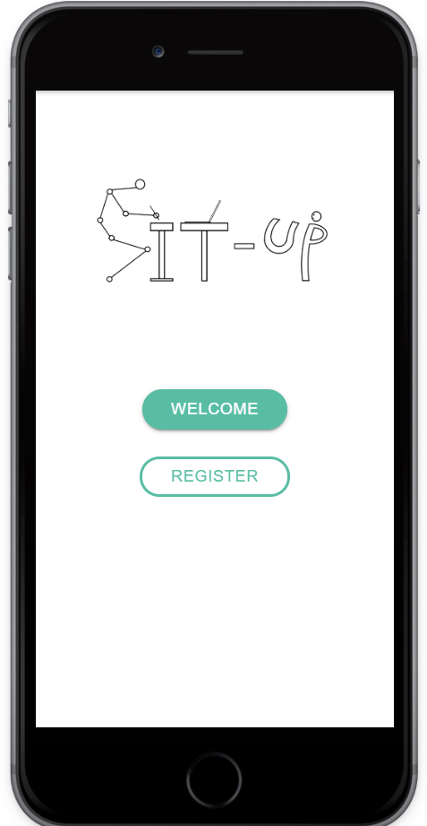
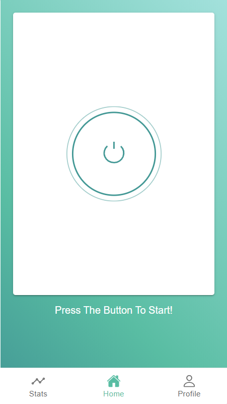
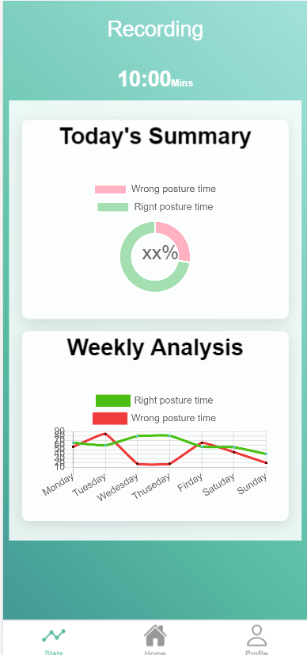
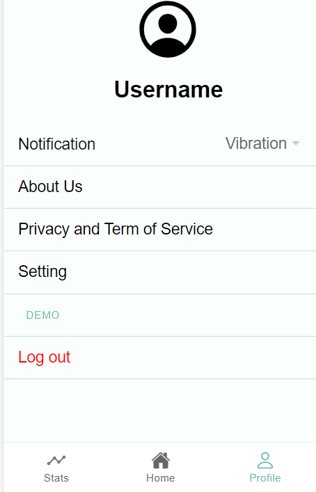
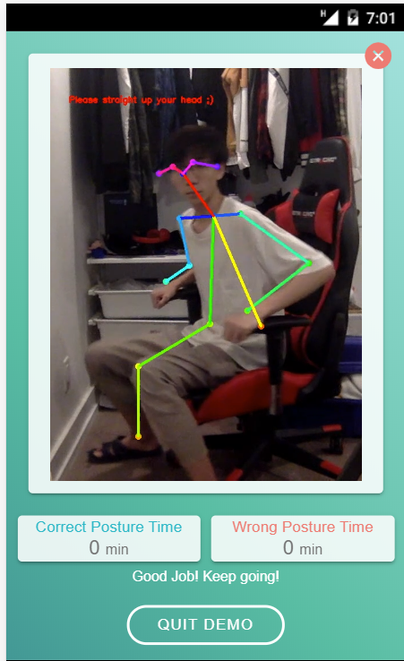

# Sit-up!
### The personalized AI posture practitioner that prevents cervical & lumbar vertebral diseases from sedentary lifestyle using deep learning and computer vision


### :1st_place_medal:1st Place Winning Project of the University of Toronto Innovation Fair 2020:1st_place_medal:

[Presentation Record](https://youtu.be/g5q0wnrUlqo)

[Presentation Slides](presentation/Sit-up_Presentation_V9.pdf)


[Run the app](#run-the-app-using-flask--ai-module--ionic)

[AI module](#ai-module)

[Demo](#demo) 


[Real Product](#real-product)


# Run the app using Flask + AI module + Ionic
## requirement 	
Python version > 3.3

[Miniconda](https://docs.conda.io/en/latest/miniconda.html)

 [ionic](https://ionicframework.com/docs/intro/cli)
 
[AI module](#ai-module)

## Run
```
conda create myenv
conda activate myenv
```
1. install all requiment according to AI module
2. copy paste all files in sitUpBackEnd to folder of pose-estimation-detection cloned from AI module
3. under conda environment, run 
```
$ cd pose-estimation-detection
$ python main.py
```
4. go to ionic folder and start the app
```
$ cd sitUpFrontEnd
$ npm i
$ ionic serve
```
enjoy the app!






# AI module

Use tf-pose-estimation
### Step0:
```cd sitUpBackEnd```
### Step1(For Mac Users): 
For download of dependencies, refer to https://medium.com/@gsethi2409/pose-estimation-with-tensorflow-2-0-a51162c095ba;

### Step1(For Windows Users):
For download of dependencies, refer to https://github.com/satyaborg/pose-estimation-detection;

### Step2: 
```mkdir result``` Note directory result is under sitUpBackEnd;
Move sit-up.py and sit_analysis.py to the folder "tf-pose-estimation"(For mac users)/"pose-estimation-detection"(for windows users) which should be downloaded after step 1;

### Step3: 

Simple test! go to the subfolder just created and run with webcamera: (for mac users): ```python sit-up.py --os=macos --direction=front``` or 
(for windows users): ```python sit-up.py --os=windows --direction=front```;
For the argument direction, you can choose front, side45 or side90;
Note when specifying side45, for the purpose of accuracy, please make sure camera is at 45 angle of your front;

# Demo
Try the demo vison with only ionic

Here are two  video demos 

- [video demo1](demoPic/demo.mp4)
- [video demo2](demoPic/demo.mp4)



```bash
$ cd setUpFrontEnd 
$ npm i
$ ionic serve
```

Then go to profile and hit the `demo` button

# Real Product


# Git Repo
https://github.com/yAya-yns/Sit-up
